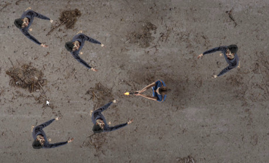

# godot-gun-shoot
simple 2D gun shoot example,based on Basic Top Down Shooter

https://godotengine.org/asset-library/asset/293

## Changed
- replace character images:made with blender & makehuman
- add background image : just sprite image insert first.
- add gun shoot sound:add sound node & play();i faild to handle mp3,somehow it forever loop
- add gun shoot effect:add particle node & emmit=true
- add light & shadow :see below

## useful links

2D Particles Demo
https://godotengine.org/asset-library/asset/118

2D lights and shadows
https://docs.godotengine.org/en/stable/tutorials/2d/2d_lights_and_shadows.html

## Usin cc0 Assets 
background image
https://polyhaven.com/a/dirty_concrete

gunshot sound
https://freesound.org/people/qubodup/sounds/238916/

gunshot particle
https://godotengine.org/asset-library/asset/783

zombie
http://www.makehumancommunity.org/skin/zombie_skin.html

weapon
https://creativetrio.art/2020/06/04/weapons-pack-002-in-case-of-zombies/

Makehuman
http://www.makehumancommunity.org/
